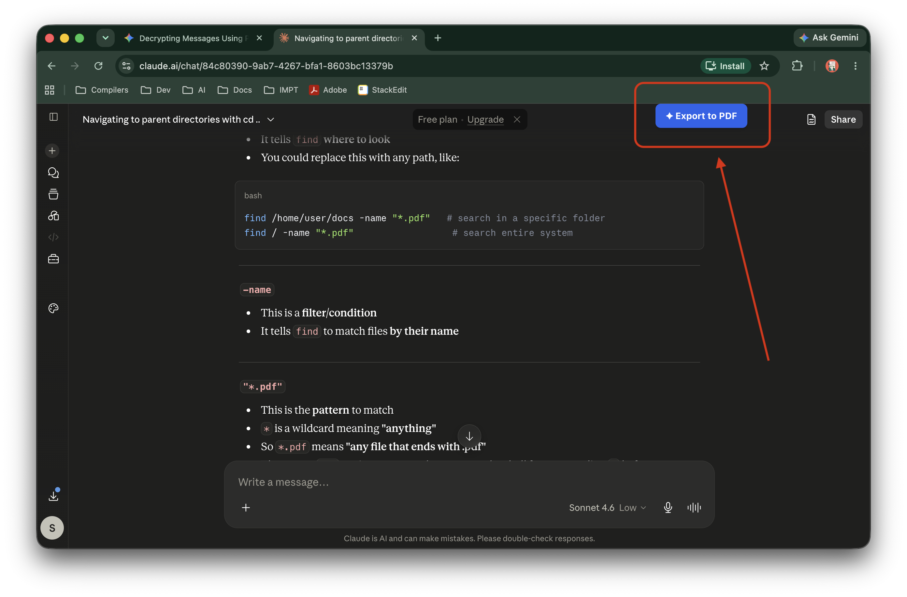
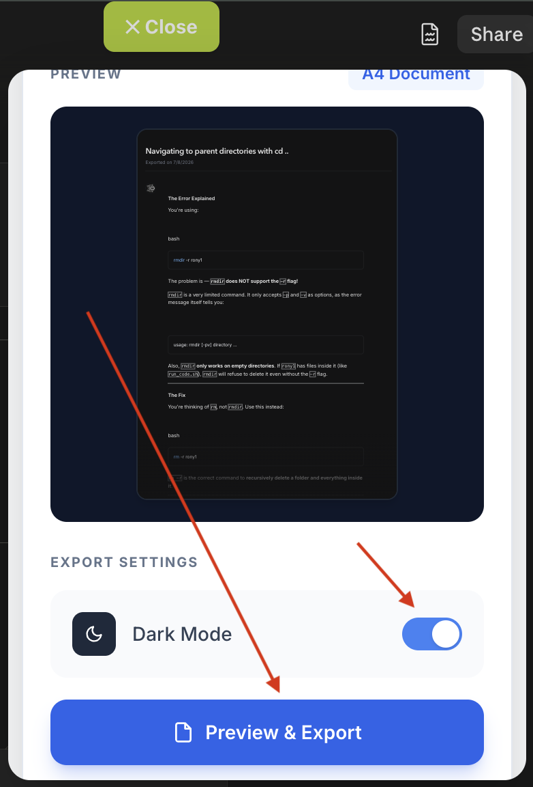
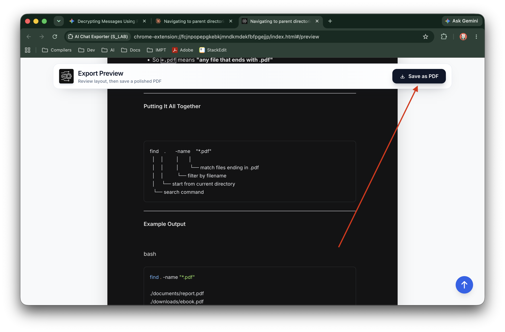

# AI Chat Exporter (S_LAB) 🚀

[]()
[]()
[]()

**AI Chat Exporter** is a powerful and intuitive browser extension that allows you to seamlessly export your AI conversations from various popular platforms into beautifully formatted PDF documents. 

Save your valuable research, coding sessions, and creative brainstorms with a single click!

## ✨ Features

- **Multi-Platform Support**: Works seamlessly with the most popular AI platforms:
  - 🤖 ChatGPT
  - ✨ Google Gemini
  - 🧠 Claude
  - 🐳 DeepSeek
  - 💬 Mistral Le Chat
  - 🐼 Qwen
- **Full-Conversation Capture**: Scroll-collects the entire thread, so even long ChatGPT chats (which virtualize off-screen messages) export completely — nothing dropped.
- **Clean A4 Output**: Exports via the browser's native print-to-PDF with print-tuned CSS — real A4 page size, sensible page breaks, and long code that wraps instead of clipping.
- **Syntax-Highlighted Code**: Code blocks are highlighted (`highlight.js`, One-Dark palette) so code stays colored and readable in the PDF.
- **Math & Equations**: Includes `KaTeX` support for rendering complex mathematical equations properly in the exported PDFs.
- **Privacy First**: Operates entirely locally in your browser. No chat data is sent to external servers.
- **Clean UI**: Built with React and TailwindCSS for a sleek, modern user experience.

## 🛠️ Tech Stack

- **Framework**: [React 19](https://react.dev/) + [Vite](https://vitejs.dev/)
- **Styling**: [TailwindCSS](https://tailwindcss.com/)
- **PDF Generation**: Browser-native print-to-PDF (A4) with print-optimized CSS
- **Sanitization & Parsing**: DOMPurify, JSDOM
- **Math Rendering**: KaTeX
- **Syntax Highlighting**: highlight.js
- **Extension Build Tool**: `@crxjs/vite-plugin`

## 🚀 Installation for Development

1. **Clone the repository:**
   ```bash
   git clone https://github.com/iamjairo/AI-Chat-exporter.git
   cd AI-Chat-exporter
   ```

2. **Install dependencies:**
   ```bash
   npm install
   ```

3. **Build the extension:**
   ```bash
   npm run build
   ```
   *(To develop with hot-reloading, run `npm run dev`)*

4. **Download it:**
   - 📥 [Download the zip](https://github.com/iamjairo/AI-Chat-exporter/raw/main/extension.zip)

5. **Load into your Browser (Chrome):**
   - Navigate to `chrome://extensions/` in your browser.
   - Enable **Developer mode** in the top right corner.
   - Click **Load unpacked** and select the `extension` folder downloaded after unzipping.

## 💡 How to Use

1. Navigate to a chat on any supported AI platform (e.g., chatgpt.com, gemini.google.com).
2. Click the **AI Chat Exporter** extension icon in your browser's toolbar.
3. Click the export button to instantly generate and download your formatted PDF



